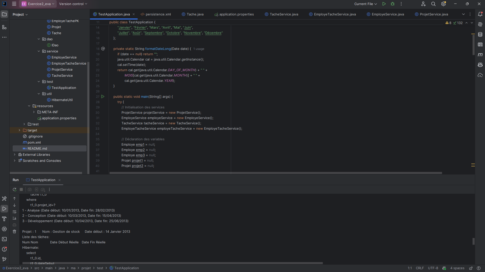
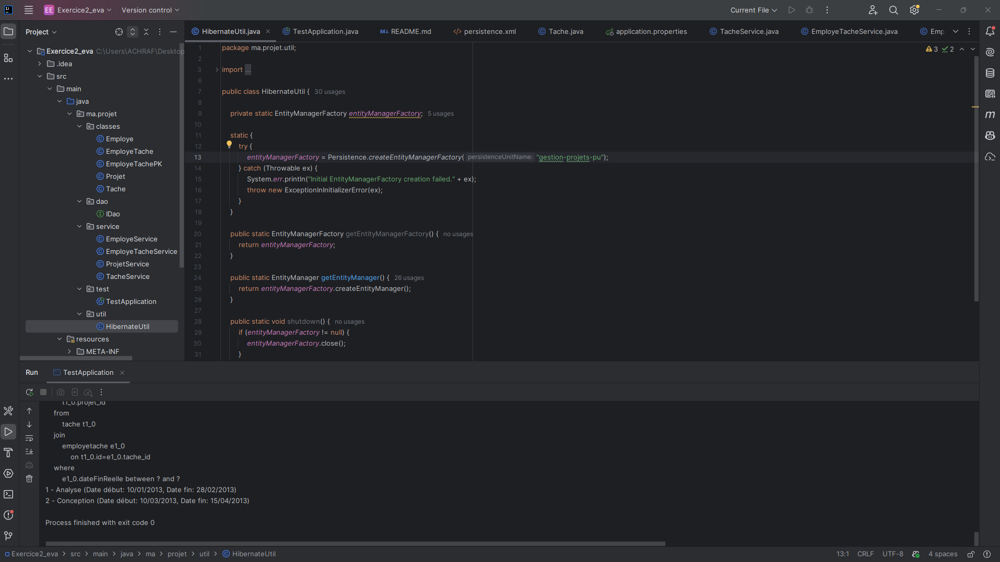

# Application de Gestion de Projets - Exercice 2

## Description
Cette application permet de gérer des projets, des employés, des tâches et leurs associations selon le diagramme UML fourni.

## Fonctionnalités implémentées

### 1. Couche Persistance
- Entités : Projet, Employe, Tache, EmployeTache
- Interface IDao générique
- Fichier de configuration : application.properties
- Classe utilitaire : HibernateUtil

### 2. Couche Service
- **ProjetService** : Gestion des projets
  - Afficher la liste des tâches planifiées pour un projet
  - Afficher la liste des tâches réalisées avec les dates réelles

- **EmployeService** : Gestion des employés
  - Afficher la liste des tâches réalisées par un employé
  - Afficher la liste des projets gérés par un employé

- **TacheService** : Gestion des tâches
  - Afficher les tâches dont le prix est supérieur à 1000 DH
  - Afficher les tâches réalisées entre deux dates

- **EmployeTacheService** : Gestion de l'association employé-tâche

### 3. Tests
Tous les tests sont implémentés dans la classe `TestApplication` qui démontre :
- Création de projets, employés et tâches
- Attribution de tâches aux employés
- Affichage des différentes listes selon les critères demandés

## Installation

### Prérequis
- Java 21
- MySQL Server
- Maven

### Étapes d'installation

1. **Configurer MySQL**
   - Exécuter le script `database.sql` pour créer la base de données et les tables
   ```bash
   mysql -u root -p < database.sql
   ```

2. **Configurer la connexion**
   - Modifier le fichier `src/main/resources/application.properties` si nécessaire
   - Par défaut : utilisateur=root, mot de passe vide, base=projet_db

3. **Compiler le projet**
   ```bash
   mvn clean install
   ```

4. **Exécuter l'application**
   ```bash
   mvn exec:java -Dexec.mainClass="ma.projet.test.TestApplication"
   ```

## Structure du projet
```
src/main/java/
├── ma/projet/
│   ├── classes/          # Entités
│   │   ├── Projet.java
│   │   ├── Employe.java
│   │   ├── Tache.java
│   │   └── EmployeTache.java
│   ├── dao/              # Interface DAO
│   │   └── IDao.java
│   ├── service/          # Services métier
│   │   ├── ProjetService.java
│   │   ├── EmployeService.java
│   │   ├── TacheService.java
│   │   └── EmployeTacheService.java
│   ├── util/             # Utilitaires
│   │   └── HibernateUtil.java
│   └── test/             # Tests
│       └── TestApplication.java
src/main/resources/
└── application.properties
```

## Affichage 

Le programme affichera :
- Projet : 4 - Gestion de stock 
- Liste des tâches par employé
- Liste des projets gérés
- Tâches planifiées vs réalisées
- Tâches avec prix > 1000 DH
- Tâches réalisées entre deux dates





## Auteur
Exercice d'évaluation - Gestion de projets

